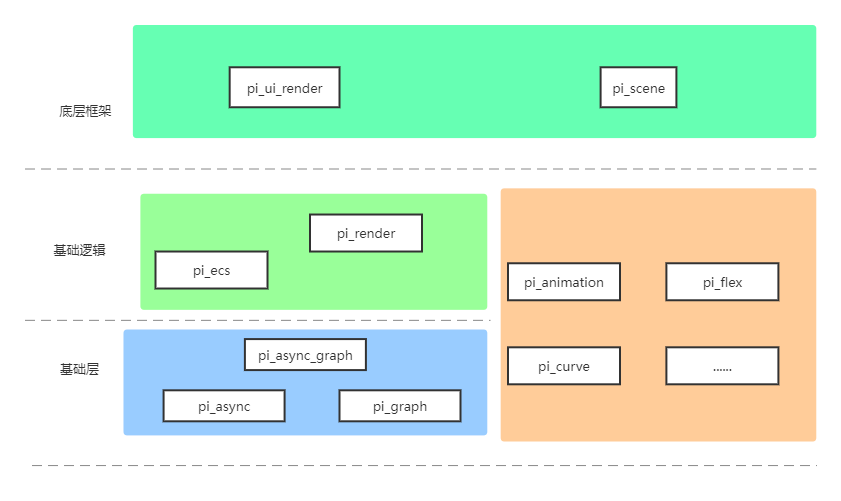
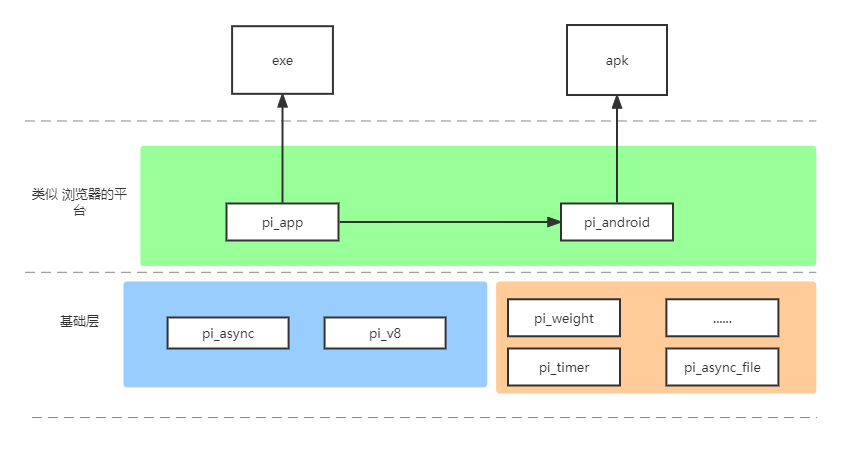
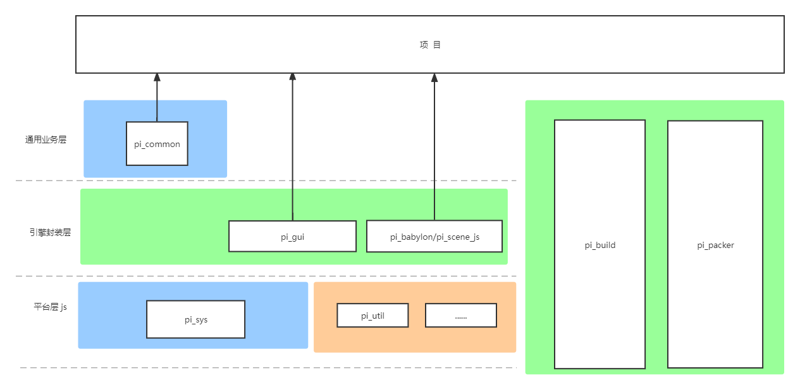

# [pi库 生态](https://github.com/GaiaWorld/pi_ecosystem)

## [crates.io 的 pi库](https://crates.io/teams/github:gaiaworld:dev)

### 客户端相关

|链接|维护者|概述|说明|
|--|--|--|--|
|[pi_flex_layout](https://github.com/GaiaWorld/pi_flex_layout)|zmax|GUI-Flex布局||
|[pi_spatialtree](https://github.com/GaiaWorld/pi_spatialtree)|zmax|空间搜索树，主要是：四叉树、八叉树 实现||
|[pi_ecs](https://github.com/GaiaWorld/pi_ecs)|wzjsun(suncy)|类似 Bevy 的 ECS（Entity-Component-System）库，处理客户端数据存和流程的基本框架，可以轻松写并发代码||
|[pi_ui_render](https://github.com/GaiaWorld/pi_ui_render)|wzjsun(suncy)|浏览器 DOM + CSS 子集 的 Rust 实现，基于ECS；包括：Flex和绝对定位布局，动画，深度，效果，变换，滚动，渲染等功能||
|[pi_scene](https://github.com/GaiaWorld/pi_scene)|baip|（正在开发）以 Babylon.js/Unity为参考的3D游戏场景渲染||
|[pi_curves](https://github.com/GaiaWorld/pi_curves)|baip|曲线模块|包括：缓动曲线，Hermite曲线，贝塞尔曲线 等的计算|
|[pi_animation](http://github.com/GaiaWorld/pi_animation)|baip|动画模块|包括：动画，动画组控制，动画融合 等共鞥你|
|[pi_3d](https://github.com/GaiaWorld/pi_3d)|baip|3D渲染相关|
|[pi_3d_loader](https://github.com/GaiaWorld/pi_3d_loader)|baip|3D加载，比如 gltf|
|[pi_spine_rs](https://github.com/GaiaWorld/pi_spine_rs)|baip|Spine的Rust渲染|
|[pi_render](https://github.com/GaiaWorld/pi_render)|moyy|基于WebGPU的Rust库（wgpu-rs）实现的，以 渲染图 为基础的 渲染基础库，供 ui-render, pi_scene 使用|
|[pi_path_finding](https://github.com/GaiaWorld/pi_path_finding)|moyy|A* 寻路算法||

### 服务器端相关

|链接|维护者|概述|说明|
|--|--|--|--|
|[pi_crypto](https://github.com/GaiaWorld/pi_crypto)|zuon|加密解密 & 数据签名|没推到 crates.io|
|[pi_vm](https://github.com/GaiaWorld/pi_vm)|zuon|JavaScript引擎，v8虚拟机的rust封装|没推到 crates.io|
|[pi_store](https://github.com/GaiaWorld/pi_store)|zuon|基于日志的数据存储|没推到 crates.io|
|[pi_rt_store](https://github.com/GaiaWorld/pi_rt_store)|zhuyijiang(zhuy)|`暂时没有实现`|
|[pi_db](https://github.com/GaiaWorld/pi_db)|zuon|数据库|没推到 crates.io|
|[pi_net](https://github.com/GaiaWorld/pi_net)|zuon|网络 `mqtt` & `rpc` & `httpc`|没推到 crates.io|
|[pi_async](https://github.com/GaiaWorld/pi_async)|zuon|rust异步运行时的执行库，前后端通用的 底层异步框架||
|[pi_async_file](https://github.com/GaiaWorld/pi_async_file)|zuon|基于异步运行时库实现的文件操作，比如：读写文件，创建文件，读写目录 等||
|[pi_rt_file](https://github.com/GaiaWorld/pi_rt_file)|zhuyijiang(zhuy)|async file 的封装，添加了多线程竞争排序|
|[pi_async_macro](https://github.com/GaiaWorld/pi_async_macro)|zuon|异步运行时 相关的 宏，配合 pi_async 使用||
|[pi_lfstack](https://github.com/GaiaWorld/pi_lfstack)|zuon|略||
|[pi_time](https://github.com/GaiaWorld/pi_time)|luob|实用库：读取系统时间||
|[pi_gray](https://github.com/GaiaWorld/pi_gray)|luob|版本灰度的简单实现||
|[pi_guid](https://github.com/GaiaWorld/pi_guid)|luob|基于时间的全局唯一id，128位-16字节||
|[pi_guid64](https://github.com/GaiaWorld/pi_guid64)|luob|基于时间的全局唯一id，64位-8字节||
|[pi_compress](https://github.com/GaiaWorld/pi_compress)|luob|封装各种压缩库|目前只封装了：`lz4`|
|[pi_timer](https://github.com/GaiaWorld/pi_timer)|baip|基于wheel的定时轮 实现的 定时器||
|[pi_file](https://github.com/GaiaWorld/pi_file)|zhuyijiang(zhuy)||
|[pi_weight_task](https://github.com/GaiaWorld/pi_weight_task)|zhuyijiang(zhuy)|任务池，基于优先级的任务调度器||
|[pi_local_timer](https://github.com/GaiaWorld/pi_local_timer)|wzjsun(suncy)|任务轮实现的延时定时器||
|[pi_cancel_timer](https://github.com/GaiaWorld/pi_cancel_timer)|wzjsun(suncy)|可取消的定时器||
|[pi_rsync](https://github.com/GaiaWorld/pi_rsync)|wzjsun(suncy)|文件rsync同步的实现|目前没用|

## 基础库

注，遇到如下数据结构，要使用这里的库，代替 基础库

|作用 / 数据结构|概念|需要用 的 库|
|--|--|--|
|`HashMap` / `HashSet`|哈希表|pi_hash|
|`rand::*`|随机数|pi_wy_rng|
|`Rc` / `Arc` / `Refcell` / `Atomic*` / `Mutex` / `RwLock`|共享指针 / 原子计数 / 锁 | pi_share|
|`Heap`|std::collections::Heap|pi_heap_ext|
|`Deque`|std::collections::Deque|pi_slot_deque|
|缓存|pi_lru|

### 库 信息表

|链接|维护者|概述|说明|
|--|--|--|--|
|[pi_assets](https://github.com/GaiaWorld/pi_assets)|zmax|资源管理器|||
|[pi_wy_rng](https://github.com/GaiaWorld/pi_wy_rng)|wzjsun(suncy)|比标准库实现更快的随机种子生成库||
|[pi_share](https://github.com/GaiaWorld/pi_share)|wzjsun(suncy)|rc & arc 封装|需要统一封装场景：单线程 & 多线程|
|[pi_hash](https://github.com/GaiaWorld/pi_hash)|wzjsun(suncy)|Hash & 哈希表|内部实现已经封装了`std`的哈希表，并且内置高效的hash算法，并且做了x86和x64平台的开关|
|[pi_ext_heap](https://github.com/GaiaWorld/pi_ext_heap)|zmax|扩展堆，支持删除和修改指定位置的元素，当堆内元素移动时，会调用回调函数|如果没有 删除 和 更新操作，可以考虑用std|
|[pi_map](https://github.com/GaiaWorld/pi_map)|wzjsun(suncy)|定义了 Map的Trait，为高层数据存储定义了通用方法；并实现了VecMap，基于vec的map实现||
|[pi_ordmap](https://github.com/GaiaWorld/pi_ordmap)|wzjsun(suncy)|一种保持顺序的map||
|[pi_atom](https://github.com/GaiaWorld/pi_atom)|wzjsun(suncy)|字符串原子|有很多相同字符串拷来拷去，比如CSS和语言关键字|
|[pi_graph](https://github.com/GaiaWorld/pi_graph)|moyy|有向循环图的数据结构和接口|
|[pi_async_graph](https://github.com/GaiaWorld/pi_async_graph)|moyy|基于 有向循环图 实现的 异步执行图，是 渲染图 和 ECS 调度器的基础数据结构|
|[pi_any](https://github.com/GaiaWorld/pi_any)|wzjsun(suncy)|Trait Object的向下造型|当参数是多态，但是某种场景有需要具体类型的时候|
|[pi_null](https://github.com/GaiaWorld/pi_null)|wzjsun(suncy)|定义了一个trait Null, 该trait提供is_null方法用于判空。||
|[pi_slot_deque](https://github.com/GaiaWorld/pi_slot_deque)|wzjsun(suncy)|基于 slot-map 的 双端队列||
|[pi_slot_wheel](https://github.com/GaiaWorld/pi_slot_wheel)|wzjsun(suncy)|基于 slot-map 的 定时轮||
|[pi_weight](https://github.com/GaiaWorld/pi_weight)|wzjsun(suncy)|基于 slot-map 的 权重树 用于存储带权重值的内容||
|[pi_sinfo](https://github.com/GaiaWorld/pi_sinfo)|wzjsun(suncy)|用于描述 struct 的 元信息|和 bon 结合使用|
|[pi_bon](https://github.com/GaiaWorld/pi_bon)|wzjsun(suncy)|序列化和反序列的库||
|[pi_ucd](https://github.com/GaiaWorld/pi_ucd)|wzjsun(suncy)|unicode快速查询的函数|比如可以查询某个point是不是中文
|[pi_util](https://github.com/GaiaWorld/pi_util)|wzjsun(suncy)|实用库：放一些实用函数和结构体||
|[pi_dirty](https://github.com/GaiaWorld/pi_dirty)|wzjsun(suncy)|可以设置脏，查询脏的容器||
|[pi_cowlist](https://github.com/GaiaWorld/pi_cowlist)|wzjsun(suncy)|写时复制的链表||
|[pi_lru](https://github.com/GaiaWorld/pi_lru)|wzjsun(suncy)|LRU缓存算法||
|`性能不高，有待优化` [pi_static_map](https://github.com/GaiaWorld/pi_static_map)|wzjsun(suncy)|完美静态哈希 的 实现||

## 附录一：内网 GitLab 项目，不会 发布到 npm 或 crates.io

#### 游戏

|链接|维护者|概述|说明|
|--|--|--|--|
|[pi_demo](http://192.168.31.241:10082/tech/pi_demo)|limh|关于上述项目的一个简单的演示例子|js项目|
|[pi_build](http://192.168.31.241:10082/tech/pi_build)|yuq|项目的构建工具，包括 资源和代码的 编译，处理，合并，压缩；并构建到各个目标平台|js项目|
|[pi_sys](http://192.168.31.241:10082/tech/pi_sys)|yuq|平台基础封装层，封装了 浏览器，小游戏，原生app，exe 等 OS和平台的差异，对外提供 统一接口|js项目|
|[pi_utils](http://192.168.31.241:10082/tech/pi_utils)|limh|js的实用数据结构和算法的封装|js项目|
|[pi_commom](http://192.168.31.241:10082/tech/pi_common)|limh|方便项目使用的通用业务逻辑代码封装， 比如：登录，支付等|js项目|
|[pi_pt](http://192.168.31.241:10082/tech/pi_pt)|luob|后端项目的封装|js项目|

#### 服务器端

|链接|维护者|概述|说明|
|--|--|--|--|
|[pi_js_proxy_gen](https://github.com/GaiaWorld/pi_js_proxy_gen)|zuon|rust和js的自动生成代码库|之后不开源，没推到 crates.io|
|[pi_js_proxy_gen_macro](https://github.com/GaiaWorld/pi_js_proxy_gen_macro)|zuon|rust和js的自动生成代码库|之后不开源，没推到 crates.io|
|[pi_logger](http://192.168.31.241:10082/tech//pi_logger)|luob|基于log4rs的日志库|rust项目|
|[pi_v8](http://192.168.31.241:10082/tech/pi_v8)|zuon|v8引擎的直接封装|rust项目|
|[pi_serv](http://192.168.31.241:10082/tech/pi_serv)|zuon|后端平台的rust层， pi-pt对应的底层实现|rust项目|
|[pi_serv_lib](http://192.168.31.241:10082/tech/pi_serv_lib)|zuon||rust项目|
|[pi_serv_builtin](http://192.168.31.241:10082/tech/pi_serv_builtin)|zuon||rust项目|
|[pi_serv_ext](http://192.168.31.241:10082/tech/pi_serv_ext)|zuon||rust项目|
|[pi_core](http://192.168.31.241:10082/tech/pi_core)|zuon||rust项目|
|[pi_core_lib](http://192.168.31.241:10082/tech/pi_core_lib)|zuon||rust项目|
|[pi_core_builtin](http://192.168.31.241:10082/tech/pi_core_builtin)|zuon||rust项目|

#### 渲染 & 游戏底层

|链接|维护者|概述|说明|
|--|--|--|--|
|[babylon](http://192.168.31.241:10082/tech/babylon)|baip|对 Babylon Fork 和 修改|js项目，包括 6边形网格 和 Unity导出插件|
|[pi_babylon](http://192.168.31.241:10082/tech/pi_babylon)|baip|基于 Babylon.js，封装给项目使用的模块|js项目|
|[pi_babylon_demo](http://192.168.31.241:10082/tech/pi_babylon_demo)|baip|pi_babylon 和 Babylon 的 Demo|js项目|
|[pi_spine](http://192.168.31.241:10082/tech/pi_spine)|baip|封装 Spine.js 给项目使用的模块|js项目|

#### 平台：Android & iOS & Windows

|链接|维护者|概述|说明|
|--|--|--|--|
|[pi_packer](http://192.168.31.241:10082/tech/pi_packer)|yuq|Android 和 Windows 版本的 打包工具，打出：APK 和 Exe|js项目|
|[pi_app](http://192.168.31.241:10082/tech/pi_core_app)|zhuyijiang(zhuy)|客户端 基础框架的底层实现，类似于 微型版本的浏览器|rust项目|
|[app_start](http://192.168.31.241:10082/tech/app_start)|zhuyijiang(zhuy)|客户端启动库，主要负责 维护启动和更新方面的逻辑，包括：apk/exe，dll/so，js快照，各游戏的依赖描述文件|rust项目|
|[pi_android](http://192.168.31.241:10082/tech/pi_android)|moyy|apk的逻辑，提供 Android Java 底层功能 供 pi_sys 调用|Java项目|
|[pi_ios](http://192.168.31.241:10082/tech/pi_ios)|moyy||Swift项目|[surfman](http://192.168.31.241:10082/tech/surfman)|zhuy|网上对应库的维护，跨平台的egl 绑定|android 添加 swappy，添加ios eagl 绑定

#### 修改的 第三方库

处于某些原因，需要 fork 一份 第三方库的源码 过来，自己维护

|链接|维护者|概述|说明|
|--|--|--|--|
|[rusty_v8](http://192.168.31.241:10082/tech/rusty_v8)|zhuyijiang(zhuy)|v8库的rust封装|之所以自己维护，是为了构建iOS平台，以及 解决 Android 平台的构建错误|
|[winit](http://192.168.31.241:10082/tech/winit)|zhuyijiang(zhuy)|跨平台的窗口和事件提供|Android 添加虚拟键盘唤起和隐藏； exe添加自定义光标，iOS适配数据缓存，绕过某些接口必须在主线程上调用||
|[minstant](http://192.168.31.241:10082/tech/minstant)|zhuyijiang(zhuy)|获取时间|适配iOS无法编译问题|
|[rodio](http://192.168.31.241:10082/tech/rodio)|zhuyijiang(zhuy)|音频播放库|适配 Android 播放切换问题|
|[rust-crypto](http://192.168.31.241:10082/tech/rust-crypto)|zhuyijiang(zhuy)|加密库|适配iOS无法编译链接问题||
|[font_kit](http://192.168.31.241:10082/tech/font_kit)|zhuyijiang(zhuy)|字体库|freetype_sys 的 canvas2d 封装|
|[freetype_sys](http://192.168.31.241:10082/tech/freetype_sys)|zhuyijiang(zhuy)|C代码的Rust绑定|从官网的2.6.5升级到2.10.4 & 添加了更多的Rust接口||

## 附录二：不计划 维护

现有项目还在用，只是 不会 主动 开发新功能

|链接|维护者|说明|
|--|--|--|
|[pi_base58](https://github.com/GaiaWorld/pi_base58)|wzjsun(suncy)|Base58 编码解码||
|[pi_deque](https://github.com/GaiaWorld/pi_deque)|wzjsun(suncy)|支持 从 中间 快速 插删 的 双端队列|如果不需要从中间插入和删除，可以考虑用`std`|
|[pi_dyn_uint](https://github.com/GaiaWorld/pi_dyn_uint)|wzjsun(suncy)|定义了一个分配id的工厂||
|[pi_enum_default_macro](https://github.com/GaiaWorld/pi_enum_default_macro)|wzjsun(suncy)|为枚举定义了Default trait的宏||
|[pi_hash_value](https://github.com/GaiaWorld/pi_hash_value)|wzjsun(suncy)|加密hash算法||
|[pi_densevec](https://github.com/GaiaWorld/pi_densevec)|wzjsun(suncy)|管理slab分配id的数据结构，当id稀疏时候使用|配套 slab一起使用|
|[pi_cross_performance](https://github.com/GaiaWorld/pi_cross_performance)|wzjsun(suncy)|||
|[pi_debug_info](https://github.com/GaiaWorld/pi_debug_info)|wzjsun(suncy)|取到一些调试信息||
|[pi_heap](https://github.com/GaiaWorld/pi_heap)|wzjsun(suncy)|支持 删除 和 更新 的 二叉堆|如果没有 删除 和 更新操作，可以考虑用`std`|
|[pi_idtree](https://github.com/GaiaWorld/pi_idtree)|wzjsun(suncy)|id树的rust实现，提供插入删除、迭代等方法||
|[pi_listener](https://github.com/GaiaWorld/pi_listener)|wzjsun(suncy)|||
|[pi_res](https://github.com/GaiaWorld/pi_res)|wzjsun(suncy)||(pi_utils 还在用) 资源的抽象接口，配合 pi_res_mgr 一起使用||
|[pi_res_mgr](https://github.com/GaiaWorld/pi_res_mgr)|wzjsun(suncy)|同类型数据管理|(pi_utils 还在用) 需要自己管理空闲块 & 绕过rust引用|
|[pi_slab](https://github.com/GaiaWorld/pi_slab)|wzjsun(suncy)|基于数组的类似hashmap的快速查找容器||
|[pi_pointer](https://github.com/GaiaWorld/pi_pointer)|wzjsun(suncy)|指针类型，类似Arc、Rc、但会将同类对象分配在一个连续的空间|基于 pi_slab|
|[pi_wheel](https://github.com/GaiaWorld/pi_wheel)|wzjsun(suncy)|全部采用常量泛型的多层定时轮||
|[pi_wtree](https://github.com/GaiaWorld/pi_wtree)|wzjsun(suncy)|权重树 用于存储带权重值的内容||
|[pi_math](https://github.com/GaiaWorld/pi_math)|wzjsun(suncy)|旧 数学库，逐渐 放弃 维护|没推到 crates.io|
|[pi_show](https://github.comGaiaWorld/pi_show)|wzjsun(suncy)|旧 GUI，逐渐 放弃 维护|没推到 crates.io|
|[pi_apm](https://github.com/GaiaWorld/pi_apm)|zuon|没人使用，没推到 crates.io|
|[pi_future](https://github.com/GaiaWorld/pi_future)|zuon|没人使用，没推到 crates.io|
|[pi_handler](https://github.com/GaiaWorld/pi_handler)|zuon|没人使用，没推到 crates.io|
|[pi_worker](https://github.com/GaiaWorld/pi_worker)|zuon|没人使用，没推到 crates.io|
|[pi_ecs_derive_old](https://github.com/GaiaWorld/pi_ecs_derive_old)|wzjsun(suncy)|暂时维护，pi_show还在使用|
|[pi_ecs_old](https://github.com/GaiaWorld/pi_ecs_old)|wzjsun(suncy)|暂时维护，pi_show还在使用|
|[pi_flex_layout_old](https://github.com/GaiaWorld/pi_flex_layout_old)|wzjsun(suncy)|暂时维护，pi_show 还在使用|
|[pi_data_view](https://github.com/GaiaWorld/pi_data_view)|wzjsun(suncy)|暂时维护，pi_show 还在使用|
|[pi_adler32](https://github.com/GaiaWorld/pi_adler32)|不维护||
|[pi_bincode](https://github.com/GaiaWorld/pi_bincode)|不维护||
|[pi_hashmap](https://github.com/GaiaWorld/pi_hashmap)|不维护|没推到 crates.io|
|[pi_idtree_old](https://github.com/GaiaWorld/pi_idtree_old)|不维护|没推到 crates.io|
|[pi_map_old](https://github.com/GaiaWorld/pi_map_old)|不维护|没推到 crates.io|
|[pi_slab_old](https://github.com/GaiaWorld/pi_slab_old)|不维护|没推到 crates.io|
|[pi_fx_hashmap](https://github.com/GaiaWorld/pi_fx_hashmap)|不维护|没推到 crates.io|
|[pi_wy_hash](https://github.com/GaiaWorld/pi_wy_hash)|不维护|没推到 crates.io|
|[pi_task_pool](https://github.com/GaiaWorld/pi_task_pool)|不维护|没推到 crates.io|
|[pi_lib](https://github.com/GaiaWorld/pi_lib)|废弃|js项目|
|[pi_sys](https://github.com/GaiaWorld/pi_sys)|废弃|js项目|
|[pi_p2p](https://github.com/GaiaWorld/pi_p2p)|废弃|rust项目|
|[pi_base](https://github.com/GaiaWorld/pi_base)|废弃|js项目|
|[pi_front](https://github.com/GaiaWorld/pi_front)|废弃|js项目|
|[pi_tools](https://github.com/GaiaWorld/pi_tools)|废弃|js项目|
|[pi_serv](https://github.com/GaiaWorld/pi_serv)|废弃|rust项目，迁移回 内网 Gitlab|
|[pi_msdf_tool](https://github.com/GaiaWorld/pi_msdf_tool)|废弃|js项目|
|[pi_ai](http://192.168.31.241:10082/tech/pi_ai)|废弃|rust项目，以废弃，改为 pi_path_finding|

## 附录三：层次 概述

### 客户端

#### 引擎：GUI & 3D

#### 平台底层：APK & Exe

#### 平台封装 & 项目工具

### 服务器

+ JS：pi_pt
+ Rust：pi_serv
  - 支撑库：pi_async, pi_db, pi_net, pi_store, pi_v8/pi_vm

